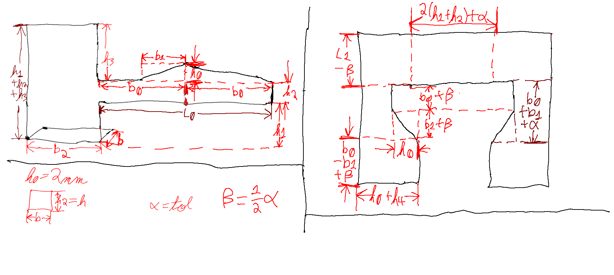
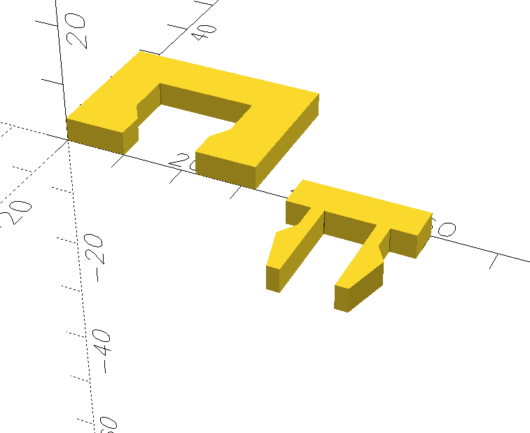

# fl4shk-cantilever_snap_fit
Cantilever Snap Fit for 3D Printing - Implemented in OpenSCAD

The geometry of the design is shown here:

Here is an image of the OpenSCAD preview window:

This snap fit was tested with PETG filament.
Other filaments may work too.
